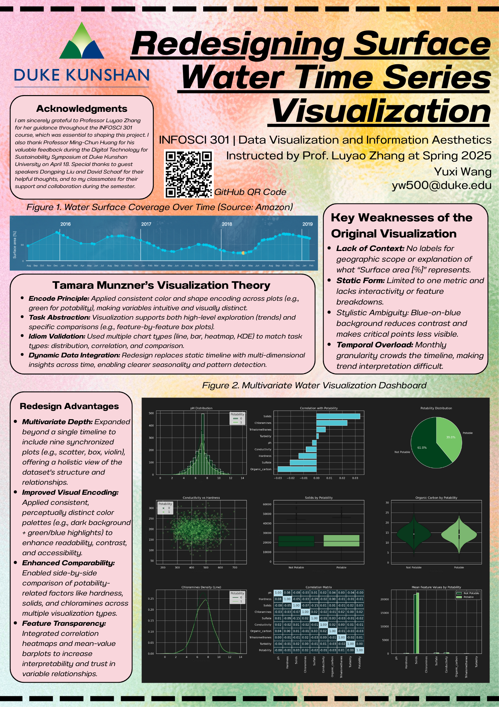

# InfoVis Redesign Project



_InfoVis Redesign Project for the INFOSCI 301 – Information Visualization and Information Aesthetics course at Duke Kunshan University._  
This repository presents a comprehensive redesign of a water quality visualization using a multiview dashboard approach. The project transforms a single-line temporal plot into a rich, theory-informed analytical interface for exploratory data tasks.

## Project Structure
This project was inspired by the original surface water visualization from the [BlueDot Observatory](https://aws.amazon.com/cn/blogs/publicsector/bluedot-observatory-keeping-an-eye-on-our-planets-water-resources/), which visualized seasonal surface water dynamics globally. The current redesign reimagines that work using a multivariate dataset and theory-guided visual encodings.

- `data/`: Water potability dataset from Kaggle
- `images/`: All output visualizations including the final dashboard and analysis diagrams
- `code/`: Modular Python scripts to generate and compose the dashboard

## Dataset Description

**Source**: [Water Potability Dataset on Kaggle](https://www.kaggle.com/code/nimapourmoradi/water-potability/input)  
**Samples**: 3,276 water samples  
**Variables**:
- `ph`: Acidity level (0–14 scale)
- `Hardness`: Calcium and magnesium concentration (mg/L)
- `Solids`: Dissolved solids (ppm)
- `Chloramines`: Disinfectant chemical (ppm)
- `Sulfate`, `Conductivity`, `Organic_carbon`, `Trihalomethanes`, `Turbidity`
- `Potability`: Binary classification (0 = Not potable, 1 = Potable)

The dataset presents a multi-dimensional view of chemical indicators used to assess water drinkability. Missing values were imputed using column-wise means. Data exploration and statistical normalization were performed prior to encoding.

## Tools Used

- Python (Pandas, Matplotlib, Seaborn, Plotly)
- GitHub for version control and reproducibility

## Visual Encodings

- **Histogram**: Feature distributions split by potability (Seaborn)
- **Scatter plot**: Variable relationships (Seaborn)
- **Box/Violin plot**: Statistical comparison of distributions (Seaborn)
- **Donut/Pie chart**: Potability proportion (Matplotlib)
- **Correlation heatmap**: Feature dependencies (Seaborn)
- **Grouped bar plot**: Mean values by class (Matplotlib)

## Clone this Repository

```bash
git clone https://github.com/wailywang/infovis-redesign-project.git
```

## Acknowledgements

This project was completed as part of the course **INFOSCI 301 – Data Visualization and Information Aesthetics** at Duke Kunshan University. I would like to sincerely thank **Prof. Luyao Zhang** for her guidance throughout the semester, and **Prof. Ming-Chun Huang** for his valuable feedback during the DKU Digital Technology for Sustainability Symposium. Special thanks also go to **Dr. Dongping Liu** and **Dr. David Schaaf** for their helpful insights and encouragement during the development of this project. Lastly, I thank my classmates in INFOSCI 301 for their thoughtful input and collaboration during the semester.

---

## Share with the Community

Please consider sharing a post about this project and the value it provides. It really does help!

[](https://www.reddit.com/submit)
[](https://news.ycombinator.com/submitlink)
[](https://twitter.com/intent/tweet)
[](https://www.facebook.com/sharer/sharer.php)
[](https://www.linkedin.com/shareArticle)

---
